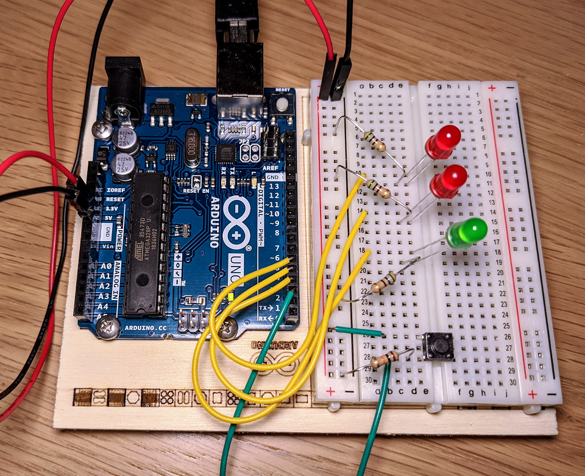

### Starship interface
This is **Project 02** from the _Arduino Project Book_. My personal addition is just a fancy blinking pattern when the button is pushed.

#### sketch
[sketch](./02-starship-interface.ino)

#### board
Compared to the original board from the book, **220Ω** resistors are replaced with the **560Ω** ones because my starter-kit is missing them.

