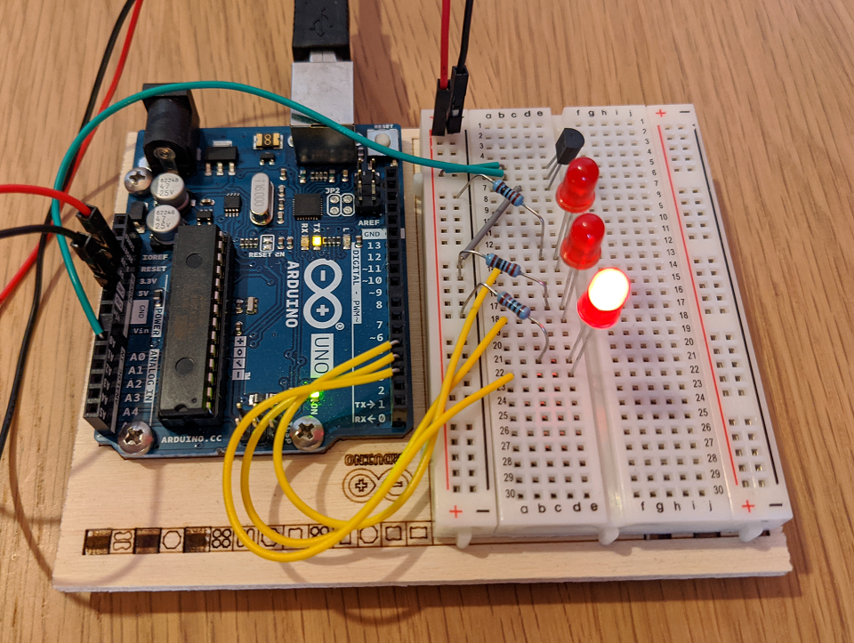

### Temperature
This is **Project 03** from the _Arduino Project Book_. My personal addition is just a better code for computing LED status, using ternary operators.

#### sketch
[sketch](./03-temperature.ino)

#### board

